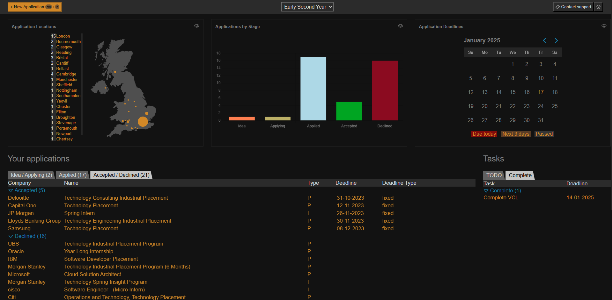
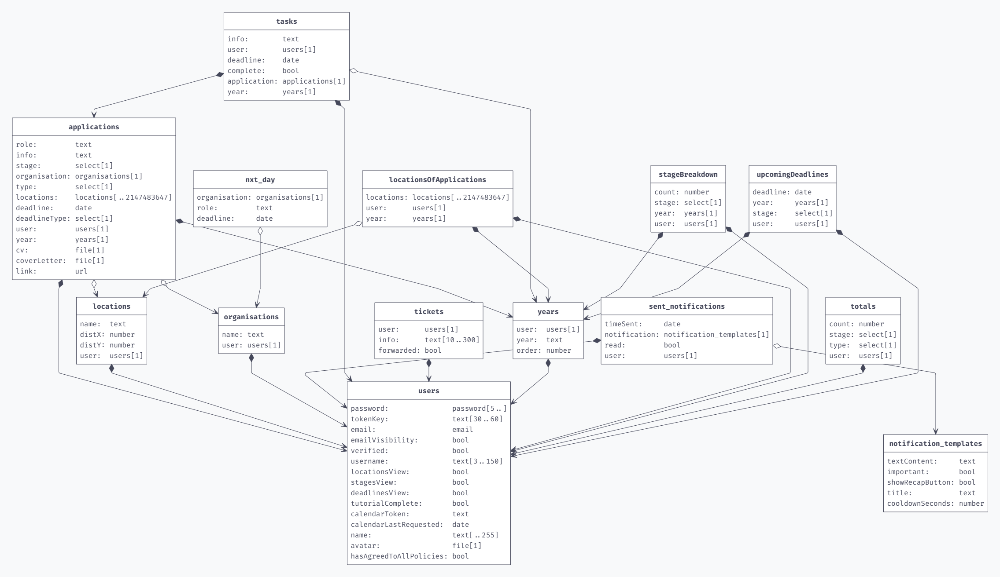

The ultimate dashboard for tracking applications to jobs, internships and placements. Designed for studnets who are applying to multiple schemes, stay on top of your applications, store documents and never miss a deadline.

<br>

### Use the application live at [exeter-tracker.com](http://#)

<br>




## Features

- **Application Tracking**: Keep a record of all applications, including company details, application status, and key dates.
- **Deadline Reminders**: Never miss a deadline with our reminders about upcoming application submissions.
- **Document Management**: Store and organize different versions of CV and cover letters.
- **Analytics**: Gain insights into your application trends and manage your overall performance.

## Database Schema


  

## Deployment Instructions

1. Git clone this repo
2. Add the three env files: frontend/.env, .env.secret and backend/.env
3. Fill out the three .env files with correct information
4. Ensure the server names in nginx.conf are correct
5. Get the SSL certificate for app.exetertracker.com using this command **make sure you update the email address first**:
    ```bash
    docker run --rm -it \
    -v "$(pwd)/certbot/conf:/etc/letsencrypt" \
    -v "$(pwd)/certbot/www:/var/www/certbot" \
    certbot/certbot certonly \
    --standalone \
    -d app.exetertracker.com \
    --email you@mail.com \
    --agree-tos \
    --no-eff-email
    ```
6. Get the SSL certificate for exetertracker.com and www.exetertracker.com using this command **make sure you update the email address first**:
    ```bash
    docker run --rm -it \
    -v "$(pwd)/certbot/conf:/etc/letsencrypt" \
    -v "$(pwd)/certbot/www:/var/www/certbot" \
    certbot/certbot certonly \
    --standalone \
    -d exetertracker.com \
    -d www.exetertracker.com \
    --email you@mail.com \
    --agree-tos \
    --no-eff-email
    ```
7. Run `docker compose build`
8. Run `docker compose up`